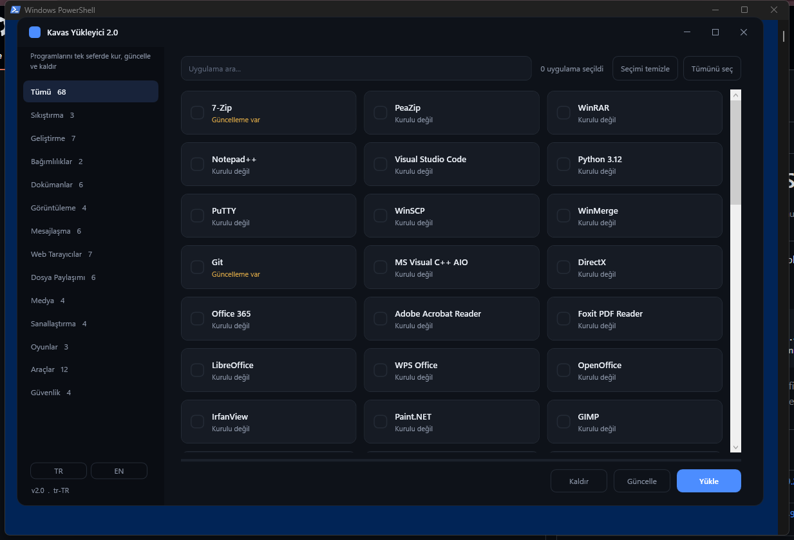

# Kavas Installer 2.0

Modern, dark-themed Windows app installer built on **winget**. Install, update and remove
your programs in one place. The UI is written in WPF (PowerShell + XAML) — no build step,
no compiler required.



## Run

```powershell
irm 'https://tinyurl.com/kavasinstaller' | iex
```

or directly:

```powershell
irm https://raw.githubusercontent.com/emircankavas/kavasinstaller/main/kavasinstaller.ps1 | iex
```

Requires Windows 10/11 with `winget` (App Installer).

## Features

- Card-based dark UI with a category sidebar, live search and filter
- Per-app **installed / update-available** badges (discovered via `winget list`)
- **Install**, **Upgrade** (`winget upgrade --all`) and **Uninstall**
- Turkish & English, auto-detected from the system culture, switchable in the sidebar
- Non-blocking operations: the window stays responsive, shows progress and reports failures

## Project layout

- `kavasinstaller.ps1` — entry point (pure ASCII, encoding-safe for `irm | iex`)
- `App.xaml` — WPF UI (dark Fluent theme, card grid, custom title bar)
- `catalog.json` — application catalog (categories + winget IDs)
- `strings.json` — localized strings (en-US, tr-TR), UTF-8

Catalog data and the UI are kept separate from the code, so apps and translations can be
edited without touching the script.

> **Encoding note:** `kavasinstaller.ps1` is intentionally ASCII-only. All non-ASCII text is
> read from the UTF-8 JSON resources at runtime, so the one-line `iex` install stays safe even
> on PowerShell 5.1, which otherwise mis-decodes BOM-less UTF-8 scripts as ANSI.
